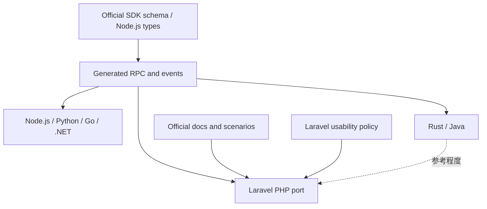

# 公式 GitHub Copilot SDK v1.0 前調査と Laravel 版同期方針

## Executive Summary

公式 GitHub Copilot SDK は v1.0.0 stable にはまだ到達していないが、v1.0.0 beta 系で Rust・Java・Canvas・remote session・mode handler などが短期間に追加されており、単純な「全部同期」は Laravel 版の価値に合わなくなっている。公式の中核は引き続き Node.js/Python の生成 RPC・session event・type 定義であり、Rust/Java は Laravel 版の実装方針を直接左右する一次情報ではなく、互換性確認やシナリオ参考に留めるべきである。[^official-structure][^sync-scope]

Laravel 版は `SessionConfig`、SystemMessage、hooks、permissions、commands、elicitation/UI、MCP、skills、attachments、telemetry、remote session、testing fake、Laravel AI SDK integration まで広く実装済みで、シンプルな Laravel 利用ではすでに十分な機能を持つ。[^laravel-session-config][^test-evidence-summary] 一方で、`preMcpToolCall` の dispatch 漏れ、`sampling.requested` の未処理、sessionFs の PHP provider adapter 不足、Canvas 未実装、RPC の一部欠落は v1.0 前に方針を決めるべき差分である。[^premcp-gap][^sampling-gap][^sessionfs-gap][^rpc-gap-summary]

今後は同期エージェントの頻度を上げるより、同期対象を「プロトコル互換に必要なもの」「Laravel のシンプルな facade / session 利用に効くもの」「ドキュメント・テストで説明できるもの」に絞る。特に Rust/Java 由来の言語固有 API、IDE/LSP、bundled CLI、Microsoft Agent Framework、Canvas のような高度 UI ランタイムは、Laravel 版の public API に直ちに持ち込まない方針が安全である。[^rust-java-tests][^docs-policy]

## 調査対象と前提

| 対象 | 位置づけ | 調査上の結論 |
| --- | --- | --- |
| `github/copilot-sdk` | 公式 SDK monorepo | Node.js/Python/Go/.NET/Rust/Java と shared tests/docs/codegen を含む。Laravel 版の一次参照は Node.js/Python generated files と docs。[^official-structure] |
| `copilot-sdk/` submodule | ローカル公式 SDK 参照 | submodule HEAD は公式 main と同じ `8e67f645b412ed6da0411026739812bcf2c1e530` と報告された。[^release-head] |
| `.github/workflows/sdk-sync.md` | 自動同期エージェント | Node.js/Python の 7 ファイルを主に見る設計で、Rust/Java/Go/.NET や公式 docs 全体は同期対象外。[^sync-scope] |
| `docs/develop/` | 開発方針ドキュメント置き場 | 調査前は空で、同期方針や parity gap を記録する文書がなかった。[^docs-develop-empty] |

## 公式 SDK の現状

公式 SDK は protocol version 3 を使い、JSON-RPC over stdio/TCP で Copilot CLI server と通信する多言語 SDK である。共有の `sdk-protocol-version.json` は version 3 を示し、protocol v3 では `external_tool.requested` と `permission.requested` が multi-client broadcast される。[^protocol-v3]

公式の public API と型定義の中心は `nodejs/src/index.ts` と `nodejs/src/types.ts` で、`SessionConfig`、tools、permissions、hooks、MCP、skills、commands、elicitation、remote sessions、telemetry、sessionFs、Canvas などがここから各言語に展開される。[^official-index][^official-types]

公式テストは `test/scenarios/` に 8 カテゴリあり、auth、bundling、callbacks、modes、prompts、sessions、tools、transport を横断的に検証する。Laravel 版が優先して参考にすべきカテゴリは sessions、tools、callbacks、prompts、transport/stdio で、auth/bundling/wasm/LSP などは Laravel package としては優先度が低い。[^official-scenarios]

## v1.0.0 へ向けたリリース状況

安定版 changelog は v0.2.2 までを記録しているが、GitHub Releases では v1.0.0-beta.1 から beta.7 までが公開されていると報告された。stable v1.0.0 は未確認であり、beta 期間中も API review や breaking change が続いているため、Laravel 版は stable tag が出るまで beta の全機能を public API として固定しない方がよい。[^release-timeline]

| Version | 主な変更 | Laravel 方針 |
| --- | --- | --- |
| v0.1.30 | built-in tool override、`session.setModel()` | 実装済み扱いで維持。[^release-timeline] |
| v0.1.31 | protocol v3 multi-client broadcast | `external_tool.requested` と `permission.requested` の安全性をテスト追加。[^protocol-v3][^broadcast-safety] |
| v0.2.0 | SystemMessage customize、OpenTelemetry、blob attachments、BYOK、`skipPermission`、`onEvent` | Laravel 版は概ね実装済み。docs と tests の不足分だけ補強。[^release-timeline][^test-evidence-summary] |
| v0.2.1 | commands、UI elicitation、metadata、Node sessionFs | commands/UI は維持。sessionFs は provider adapter を実装するか v1.0 外と明記。[^sessionfs-gap] |
| v0.2.2 | `enableConfigDiscovery` | Laravel 版に存在し、session-config doc にも記載。[^docs-coverage] |
| v1.0.0-beta.1-7 | instructionDirectories、TCP token、remote sessions、mode handlers、Java/Rust、Canvas、runtime_instructions | stable まで新規大型 API は原則 defer。小さな dispatch bug は修正対象。[^release-timeline] |

## Laravel 版の実装カバレッジ

Laravel 版は公式 SDK の主要な利用面をかなり広くカバーしている。`SessionConfig` は model/reasoning/tools/commands/systemMessage/hooks/permission/elicitation/MCP/skills/remote/cloud/onEvent などを持ち、テストでも round-trip と型変換が確認されている。[^laravel-session-config]

SystemMessage は `append`、`replace`、`customize` と section override を実装し、テストされている。[^system-message] Hooks は型として 7 種類を持つが、dispatch map は 6 種類に留まり `preMcpToolCall` が漏れている。[^premcp-gap]

Permission、commands、elicitation/UI、custom tools、attachments、MCP config、skills、telemetry、remote session、fake/testing、Laravel AI SDK integration はそれぞれ実装・テストが確認されている。[^permission-handler][^commands-ui][^attachments-telemetry][^fake-ai]

| 機能 | Laravel status | v1.0 前の判断 |
| --- | --- | --- |
| Core session / send / stream / resume | 実装済み | 維持。シンプル API の中心。 |
| Tools / permissions / commands / elicitation | 実装済み、ただし一部 RPC 追加余地 | Laravel 版の主力機能として維持。missing RPC は必要分のみ追加。 |
| Hooks | 型は広いが `preMcpToolCall` dispatch 漏れ | 修正対象。小さく効果が大きい。 |
| MCP / skills | 実装済み | 維持。`sampling.requested` は方針決定が必要。 |
| Telemetry / TraceContext | 実装済み、実 OTel はテスト環境で未検証 | docs と optional dependency 前提を明記。 |
| sessionFs | 型と `setProvider` はあるが provider adapter がない | v1.0 で実装するか、RPC-only と明記。 |
| Remote sessions | 実装済みだが scope の誤り報告あり | `sessions.connect` と `session.remote.connectRemoteSession` の差分を確認・修正。 |
| Canvas | 公式 beta で登場、Laravel 未実装 | v1.0 では defer。Laravel のシンプル利用には不要。 |
| Rust / Java SDK parity | 公式に存在 | Laravel 版では同期対象外。scenario 参考のみ。 |

## 主要ギャップ

### 1. `preMcpToolCall` hook dispatch

`SessionHooks` は `onPreMcpToolCall` を持ち、入力/出力 type のテストもあるが、`HasHooks::handleHooksInvoke()` の `$handlerMap` に `preMcpToolCall` がないため、SDK-hosted hook としては発火しない。[^premcp-gap]

**方針:** v1.0 前に修正する。型とテスト資産はすでにあるため、dispatch map とテスト追加で完結する可能性が高い。

### 2. `sampling.requested` の未処理

`SessionEventType` には `sampling.requested` / `sampling.completed` があるが、`Session::handleBroadcastEvent()` は sampling を処理せず、`PendingUi` 側にも `handlePendingSampling` がないと報告された。[^sampling-gap][^rpc-gap-summary]

**方針:** MCP sampling を Laravel 版の v1.0 対象に入れるなら `session.mcp.executeSampling`、`session.ui.handlePendingSampling`、broadcast handler を追加する。MCP sampling を高度機能として後回しにするなら、未対応として docs に明記する。

### 3. sessionFs provider adapter

Laravel 版には `src/Types/Rpc/SessionFs*.php` と `PendingServerSessionFs::setProvider()` があるが、CLI からの `sessionFs.readFile` / `writeFile` / `mkdir` など inbound RPC を受ける PHP handler 登録がない。[^sessionfs-gap]

**方針:** PHP/Laravel の実用シナリオがある場合のみ adapter を実装する。想定用途は multi-tenant storage、Laravel Flysystem、serverless / remote workspace。実装しないなら「RPC 型はあるが provider には未対応」と docs に明記する。

### 4. RPC surface の欠落

調査では session event は 81/81 parity と報告された一方、RPC は session/server 両方に欠落がある。特に `session.model.setReasoningEffort`、`session.commands.execute/enqueue`、`session.tasks.*`、`session.options.update`、`session.permissions.locations.*`、`sessions.close/list/connect/save/pruneOld`、`secrets.addFilterValues` などが未実装候補として挙がった。[^rpc-gap-summary]

**方針:** すべてを同期しない。Laravel の public API として必要なもの、既存 trait の応答経路を閉じるもの、session lifecycle の正しさに関係するものを優先する。

### 5. Canvas

公式 beta.7 で Canvas runtime が追加されたと報告されたが、Laravel 版には canvas 関連の class/RPC/docs/tests がない。[^release-timeline] Canvas は structured UI / runtime feature に近く、Laravel の `Copilot::run()` / `Copilot::start()` 中心のシンプル利用とは距離がある。

**方針:** v1.0 では defer。公式 stable 後に、Laravel 側でどう表現できるかを別 ADR として検討する。

## 同期エージェントの現状評価

`.github/workflows/sdk-sync.md` は週 3 回の agentic workflow として、`nodejs/src/generated/rpc.ts`、`nodejs/src/generated/session-events.ts`、Python generated RPC/events、`nodejs/src/client.ts`、`nodejs/src/session.ts`、`nodejs/src/types.ts` を主に確認する。[^sync-scope] 新 feature に対応する `docs/jp/*.md` がない場合は、新規 doc を作らず skip する設計だと報告された。[^docs-policy]

この設計は「公式 SDK の全言語全機能を同期する」ものではなく、Laravel 版に必要な JSON-RPC / event / type の変化を拾う設計として妥当である。ただし、公式 docs や GitHub Releases の beta notes にしか現れない feature は見落としやすい。[^docs-policy][^release-timeline]

## 今後の同期方針

### 採用する

1. Protocol version、generated RPC、session events、Node/Python type の破壊的変更。
2. Laravel の `Copilot::run()`、`Copilot::start()`、`Session`、Facade、Testing fake に直結する機能。
3. MCP、tools、permissions、commands、elicitation、hooks のように Laravel app から実用しやすい拡張点。
4. 既存実装の応答経路を閉じるために必要な missing RPC。

### 慎重に採用する

1. sessionFs provider adapter。
2. remote session の advanced 操作。
3. tasks / background agents の管理 RPC。
4. telemetry の advanced override。
5. Canvas のような runtime/UI API。

### 採用しない、または v1.0 外

1. Rust/Java/Go/.NET 固有の public API 形状。
2. Bundled CLI auto-download。
3. Microsoft Agent Framework integration。
4. IDE/LSP/folder trust/wasm など Laravel package と無関係な環境依存機能。
5. Node.js 固有の `Symbol.asyncDispose`、Zod schema API。

## 推奨ロードマップ

### v1.0 前に修正する

| Priority | 項目 | 理由 |
| --- | --- | --- |
| High | `preMcpToolCall` dispatch を追加 | 型はあるのに発火しないため correctness gap。[^premcp-gap] |
| High | `sampling.requested` の方針決定 | MCP sampling をサポートするか未対応明記が必要。[^sampling-gap] |
| High | `sessions.close/connect` と remote scope を確認 | session lifecycle と remote session の正しさに関わる。[^rpc-gap-summary] |
| Medium | `session.model.setReasoningEffort` / commands / UI pending handlers の不足確認 | 既存機能の完全性に関わる。[^rpc-gap-summary] |
| Medium | `docs/jp/session-fs.md` 追加または未対応明記 | 現状は `rpc.md` にあるだけで使い方が分からない。[^docs-coverage] |

### stable v1.0 後に再評価する

| 項目 | 再評価条件 |
| --- | --- |
| Canvas | 公式 docs と scenario が整い、PHP で自然な API が設計できること。 |
| sessionFs adapter | Laravel Flysystem 等との明確なユースケースがあること。 |
| Rust/Java parity | Node/Python generated files と異なる protocol 仕様が Rust/Java 側で先行した場合のみ参照。 |
| Full RPC parity | Laravel の public API に露出する必要があるものだけを追加。 |

## ドキュメント整備

`docs/develop/` には今後、以下を残すと同期判断がしやすい。

1. 本文書を parity / strategy の基準点にする。
2. 公式 stable release ごとに「採用・保留・省略」を追記する。
3. `docs/jp/session-fs.md` を作る場合は、provider adapter を実装してから追加する。
4. Canvas は v1.0 では「公式 beta で確認、Laravel 版では defer」と明記する。
5. Rust/Java は「同期対象外、scenario 参考のみ」と明記する。

## Confidence Assessment

確実性が高いのは、Laravel 版の主要 type/test 実装、`preMcpToolCall` dispatch 漏れ、`sampling.requested` handler 不足、sessionFs provider adapter 不足、同期エージェントの対象範囲である。これらはローカルファイルの行範囲つき調査に基づく。[^premcp-gap][^sampling-gap][^sessionfs-gap][^sync-scope]

注意が必要なのは、v1.0.0 beta release 情報と Canvas の扱いである。複数の調査結果は「CHANGELOG は v0.2.2 まで」「GitHub Releases は v1.0.0-beta.7 まで」「Canvas は beta.7 で登場」と報告している一方、公式 docs/submodule 内の Canvas 露出については調査結果に揺れがあった。したがって Canvas は「存在しない」ではなく、「公式 beta で報告あり、Laravel 版では未実装・v1.0 では defer」と扱うのが安全である。[^release-timeline]

本調査は subagent の検索結果のみを統合しており、本文書作成時点では追加の手元 grep や実行テストは行っていない。今後実装に入る前には、該当ファイルを直接確認し、`composer run test` と `composer run lint` で検証する必要がある。

## Footnotes

[^official-structure]: `github/copilot-sdk` commit `8e67f645b412ed6da0411026739812bcf2c1e530`; root directory listing; `nodejs/`, `python/`, `go/`, `dotnet/`, `rust/`, `java/`, `scripts/codegen/`, `test/`, `docs/`, `sdk-protocol-version.json`.

[^sync-scope]: `.github/workflows/sdk-sync.md:91-107`; sync target list includes `nodejs/src/generated/rpc.ts`, `nodejs/src/generated/session-events.ts`, `python/copilot/generated/rpc.py`, `python/copilot/generated/session_events.py`, `nodejs/src/client.ts`, `nodejs/src/session.ts`, `nodejs/src/types.ts`.

[^laravel-session-config]: `src/Types/SessionConfig.php:106-142`; `tests/Unit/Types/SessionConfigTest.php:14-338`.

[^test-evidence-summary]: `tests/Unit/Types/SystemMessageConfigTest.php:74-127`; `tests/Feature/SessionTest.php:235-249`; `tests/Feature/SessionTest.php:346-379`; `tests/Unit/Rpc/PendingUiTest.php:13-124`; `tests/Feature/CopilotFakeTest.php:17-213`; `tests/Feature/AiSdkTest.php:10-22`.

[^premcp-gap]: `src/Types/SessionHooks.php:24-64`; `tests/Unit/Types/SessionHooksTest.php:8-117`; `src/Concerns/Session/HasHooks.php:45-52`; `tests/Unit/Types/Hooks/PreMcpToolCallHookInputTest.php:8-138`.

[^sampling-gap]: `src/Enums/SessionEventType.php:101-103`; `tests/Unit/Enums/SessionEventTypeTest.php:58-66`; `src/Session.php:510-601`.

[^sessionfs-gap]: `src/Rpc/PendingServerSessionFs.php:25-33`; `tests/Unit/Rpc/PendingServerSessionFsTest.php:10-70`; `tests/Unit/Types/Rpc/SessionFsSqliteTypesTest.php:15-334`; `src/Client.php:140-157`.

[^rpc-gap-summary]: `copilot-sdk/nodejs/src/generated/rpc.ts`; `src/Rpc/SessionRpc.php`; `src/Rpc/ServerRpc.php`; `src/Rpc/PendingModel.php`; `src/Rpc/PendingCommands.php`; `src/Rpc/PendingTasks.php`; `src/Rpc/PendingUi.php`; `src/Rpc/PendingSessions.php`.

[^rust-java-tests]: `github/copilot-sdk:test/scenarios/RUST_COVERAGE.md:8-44`; `copilot-sdk/java/src/test/java/com/github/copilot/sdk/HooksTest.java:38-41`.

[^docs-policy]: `.github/workflows/sdk-sync.md:261`; `.github/workflows/sdk-sync.md:267-276`; `docs/develop/` empty directory observation from research subagent.

[^docs-develop-empty]: `docs/develop/`; research subagent reported no files matched under `docs/develop/**`.

[^protocol-v3]: `github/copilot-sdk:sdk-protocol-version.json:1-3`; `github/copilot-sdk:CHANGELOG.md:1-453`.

[^official-index]: `github/copilot-sdk:nodejs/src/index.ts:1-138`, SHA `42498c58`.

[^official-types]: `github/copilot-sdk:nodejs/src/types.ts:65-154`; `github/copilot-sdk:nodejs/src/types.ts:168-287`; `github/copilot-sdk:nodejs/src/types.ts:1412-1670`; `github/copilot-sdk:nodejs/src/types.ts:1777-1826`.

[^official-scenarios]: `github/copilot-sdk:test/scenarios/README.md:1-39`; `github/copilot-sdk:test/scenarios/auth/byok-openai/README.md:1-37`; `github/copilot-sdk:test/scenarios/prompts/system-message/README.md:1-32`; `github/copilot-sdk:test/scenarios/sessions/streaming/README.md:1-17`; `github/copilot-sdk:test/scenarios/tools/mcp-servers/README.md:1-44`.

[^release-head]: `github/copilot-sdk` main HEAD and local submodule HEAD both reported as `8e67f645b412ed6da0411026739812bcf2c1e530` by release timeline research.

[^release-timeline]: GitHub Releases for `github/copilot-sdk` v1.0.0-beta.1 through v1.0.0-beta.7, fetched by research subagent; `github/copilot-sdk:CHANGELOG.md:1-452` covers stable releases v0.1.30 through v0.2.2.

[^broadcast-safety]: `src/Session.php:510-601`; `src/Concerns/Session/HasToolHandlers.php:49`; `src/Concerns/Session/HasPermissionHandler.php:45`.

[^system-message]: `src/Types/SystemMessageConfig.php:22-67`; `tests/Unit/Types/SystemMessageConfigTest.php:74-127`.

[^permission-handler]: `src/Concerns/Session/HasPermissionHandler.php:19-93`; `tests/Feature/SessionTest.php:346-379`; `src/Session.php:531-544`.

[^commands-ui]: `src/Concerns/Session/HasCommandHandlers.php:20-132`; `src/Session.php:545-555`; `src/Concerns/Session/HasElicitationHandler.php:23-87`; `src/Concerns/Session/HasUiApi.php:20-198`; `tests/Unit/Rpc/PendingUiTest.php:13-124`.

[^attachments-telemetry]: `src/Support/Attachment.php:11-52`; `tests/Unit/Support/AttachmentTest.php:7-49`; `src/Types/TelemetryConfig.php:25-87`; `tests/Unit/Types/TelemetryConfigTest.php:8-127`; `src/Support/TraceContext.php:21-147`.

[^fake-ai]: `src/Testing/CopilotFake.php:19-211`; `tests/Feature/CopilotFakeTest.php:17-213`; `tests/Feature/AiSdkTest.php:10-22`.

[^docs-coverage]: `docs/jp/session-config.md:44-47`; `docs/jp/session-config.md:79-93`; `docs/jp/session-config.md:105-128`; `docs/jp/rpc.md:68-69`; `docs/jp/rpc.md:439-451`; `docs/jp/telemetry.md`; `docs/jp/custom-providers.md`; `docs/jp/remote-sessions.md`; `docs/jp/ai-sdk.md`.
